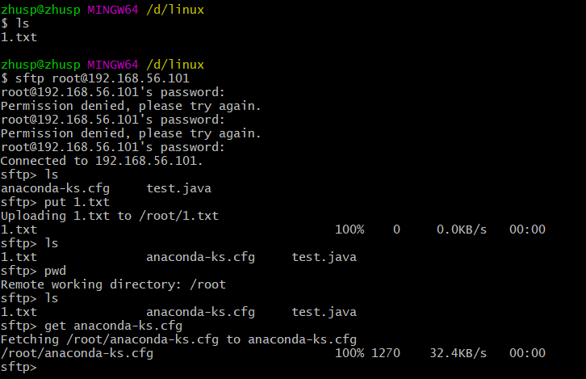

# dockerfile-study

* 复习了以前学过的docker知识
* 着手dockerfile的学习

### 记录一些平时常用指令

####  sftp

Secure Ftp 是一个基于SSH安全协议的文件传输管理工具。由于它是基于SSH的，会在传输过程中对用户的密码、数据等敏感信息进行加密，因此可以有效的防止用户信息在传输的过程中被窃取，比FTP有更高的安全性。在功能方面与FTP很类似，不仅可以传输文件数据，而且可以进行远程的文件管理（如建立，删除，查看文件列表等操作）。Sftp与ftp虽然只有一字之差，但基于的传输协议却是不同的。因此不能用sftp client去连接ftp server 也不能用 ftp client 去连接 sftp server8。

要连接的主机：root和192.xxx.xx.101是要连接的主机用户名和ip

```shell
sftp root@192.***.**.101
root@192.***.**.101's password:
```

上传文件就使用命令put：

```shell
sftp> put 1.txt
```

下载文件就使用命令get

```
sftp> get anaconda-ks.cfg
```



#### scp

SCP ：secure copy (remote file copy program) 也是一个基于SSH安全协议的文件传输命令。与sftp不同的是，它只提供主机间的文件传输功能，没有文件管理的功能。

复制local_file 到远程目录remote_folder下（不知道为什么连接）

```shell
zhusp@zhusp MINGW64 /d/linux
$ scp -r zsp_file root@:192.***.**.101:zsp
ssh: connect to host  port 22: Connection refused
lost connection
```

#### wget

wget是Linux下下载文件的最常用命令。wget支持HTTP，HTTPs和FTP协议，支持自动下载，即可以在用户退出系统后在后台执行，直到下载结束。
用法: wget[参数] [URL]

**常用参数**

* -o∶将日志信息写入FILE;
* -b∶启动后转入后台;
* -O∶将文档写入FILE(重命名);
* -q︰安静模式（无信息输出);
* -N:只获取比本地文件新的文件;
* --no-check-certificate :不要验证HTTPS服务器的证书;
* -r:指定递归下载;
* -c:断点续传下载文件。

```shell
[root@localhost ~]# wget -O scan.rpm https://download.docker.com/linux/centos/7/x86_64/stable/Packages/docker-scan-plugin-0.8.0-3.el7.x86_64.rpm
--2021-09-30 21:21:52--  https://download.docker.com/linux/centos/7/x86_64/stable/Packages/docker-scan-plugin-0.8.0-3.el7.x86_64.rpm
正在解析主机 download.docker.com (download.docker.com)... 52.85.202.24, 52.85.202.82, 52.85.202.18, ...
正在连接 download.docker.com (download.docker.com)|52.85.202.24|:443... 已连接。
已发出 HTTP 请求，正在等待回应... 200 OK
长度：4373740 (4.2M) [binary/octet-stream]
正在保存至: “scan.rpm”

100%[=============================================================================>] 4,373,740    543KB/s 用时 8.1s   

2021-09-30 21:22:05 (527 KB/s) - 已保存 “scan.rpm” [4373740/4373740])

[root@localhost ~]# ls
1.txt  anaconda-ks.cfg  scan.rpm  test.java  zsp

```

#### curl

* 获取页面内容,默认会发送 GET 请求来获取链接内容到标准输出。

```shell
curl www.baidu.com
```

* 显示 HTTP 头：显示 HTTP 头，而不显示文件内容，使用 -I 选项

```shell
curl -I www.baidu.com
```

* 同时显示 HTTP 头和文件内容，使用 -i 选项

```shell
curl -i www.baidu.com
```

* 将返回结果保存到文件：使用-o参数

```shell
curl -o save.txt www.baidu.com
```

* 链接重定向
  使用 -L 跟随链接重定向，逻辑为http://codebelief.com -> http://www.codebelief.com
  实例：curl -L http://codebelief.com
* 使用 -H 自定义 header
  实例1：curl -H “Referer: www.example.com” -H “User-Agent: Custom-User-Agent” http://www.baidu.com
  实例2：curl -H “Cookie: JSESSIONID=D0112A5063D938586B659EF8F939BE24” http://www.example.com
* 使用 -c 保存 Cookie
  当我们使用 cURL 访问页面的时候，默认是不会保存 Cookie 的。有些情况下我们希望保存 Cookie 以便下次访问时使用。例如登陆了某个网站，我们希望再次访问该网站时保持登陆的状态，这时就可以现将登陆时的 Cookie 保存起来，下次访问时再读取。-c 后面跟上要保存的文件名。
  实例：curl -c “cookie-example” http://www.example.com
* 使用 -b 读取 Cookie
  前面讲到了使用 -H 来发送 Cookie 的方法，这种方式是直接将 Cookie 字符串写在命令中。如果使用 -b 来自定义 Cookie，命令如下：
  实例1：curl -b “JSESSIONID=D0112A5063D938586B659EF8F939BE24” http://www.example.com
  实例2：curl -b "cookie-example " http://www.example.com
* 使用 -d 发送 POST 请求
  我们以登陆网页为例来进行说明使用 cURL 发送 POST 请求的方法。假设有一个登录页面 www.example.com/login，只需要提交用户名和密码便可登录。我们可以使用 CURL 来完成这一 POST 请求，-d 用于指定发送的数据，-X 用于指定发送数据的方式：
  实例1：curl -d “userName=tom&passwd=123456” -X POST http://www.example.com/login
  实例2：curl -d " {“name”:“1234”,“id”:“c62f7bff-d8d7-402a-935f-e33b539a9ed7”}" -X POST http://www.example.com/login
  参数以文件方式
  实例3：curl -d “@data.txt” -X POST http://www.example.com/login
  文件上传
  使用了-F参数，curl会以multipart/form-data的方式发送POST请求。-F以key=value的形式指定要上传的参数，如果是文件，则需要使用key=@file的形式。
  实例1：curl -F “key=value” -F “filename=@file.tar.gz” http://localhost/upload
  其他命令
  其他命令参考：http://man.linuxde.net/curl
  
**使用root权限进入docker容器**
[root@localhost store]# docker exec -it -u root  6bb7 /bin/bash
