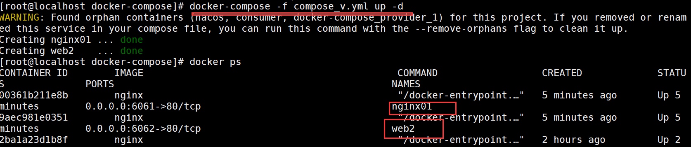
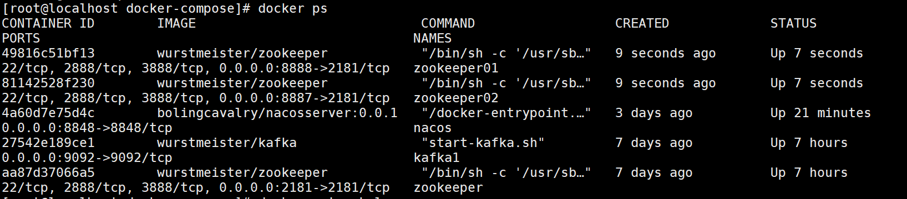
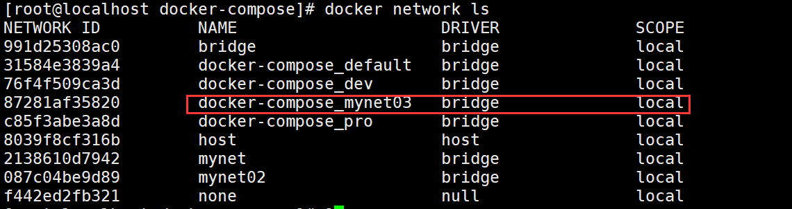
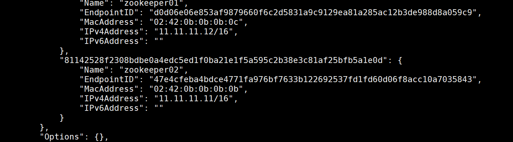

# Docker-compose

​	Compose 是用于定义和运行多容器 Docker 应用程序的工具。通过 Compose，您可以使用 YML 文件来配置应用程序需要的所有服务。然后，使用一个命令，就可以从 YML 文件配置中创建并启动所有服务。

## dockerfile、docker-compose、Kubernetes的区别

### Docker

​	Docker 这个东西所扮演的角色，容易理解，它是一个容器引擎，也就是说实际上我们的容器最终是由Docker创建，运行在Docker中，其他相关的容器技术都是以Docker为基础，它是我们使用其他容器技术的核心。

### Docker-Compose

​	Docker-Compose 是用来管理你的容器的，有点像一个容器的管家，想象一下当你的Docker中有成百上千的容器需要启动，如果一个一个的启动那得多费时间。有了Docker-Compose你只需要编写一个文件，在这个文件里面声明好要启动的容器，配置一些参数，执行一下这个文件，Docker就会按照你声明的配置去把所有的容器启动起来，只需docker-compose up即可启动所有的容器，但是Docker-Compose只能管理**当前主机**上的Docker，也就是说不能去启动**其他主机**上的Docker容器

### Docker Swarm

​	Docker Swarm 是一款用来管理**多主机**上的Docker容器的工具，可以负责帮你**启动容器，监控容器状态，如果容器的状态不正常它会帮你重新帮你启动一个新的容器，来提供服务，同时也提供服务之间的负载均衡**，而这些东西Docker-Compose 是做不到的

### Kubernetes

​	Kubernetes它本身的**角色定位是和Docker Swarm 是一样的**，也就是说他们负责的工作在容器领域来说是相同的部分，都是一个**跨主机的容器管理平台**，当然也有自己一些不一样的特点，k8s是谷歌公司根据自身的多年的运维经验研发的一款容器管理平台。而Docker Swarm则是由Docker 公司研发的。

​	既然这两个东西是一样的，那就面临选择的问题，应该学习哪一个技术呢?实际上这两年Kubernetes已经成为了很多大公司的默认使用的容器管理技术，而Docker Swarm已经在这场与Kubernetes竞争中已经逐渐失势，如今容器管理领域已经开始已经逐渐被Kubernetes一统天下了。所以建议大家学习的时候，应该多考虑一下这门技术在行业里面是不是有很多人在使用。

​	需要注意的是，虽然Docker Swarm在与Kubernetes的竞争中败下阵来，但是这个跟Docker这个容器引擎没有太大关系，它还是整个容器领域技术的基石，Kubernetes离开他什么也不是。

### 总结

​	Docker是容器技术的核心、基础，Docker Compose是一个**基于Docker的单主机容器编排工具.而k8s是一个跨主机的集群部署工具**，功能并不像Docker Swarm和Kubernetes是基于Dcoker的跨主机的容器管理平台那么丰富

## 安装docker compose

* 下载 Docker Compose 的当前稳定版本

```shell
$ sudo curl -L "https://github.com/docker/compose/releases/download/1.24.1/docker-compose-$(uname -s)-$(uname -m)" -o /usr/local/bin/docker-compose

```

* 更改二进制安装文件权限

```shell
$ sudo chmod +x /usr/local/bin/docker-compose
```

* 创建软链：进行映射

```shell
$ sudo ln -s /usr/local/bin/docker-compose /usr/bin/docker-compose
```

* 测试安装是否成功

```shell
$ docker-compose --version
cker-compose version 1.24.1, build 4667896b
```

* 卸载命令

```shell
$ pip uninstall docker-compose
```

## 执行步骤

docker-compose的运行整体步骤：

* 写docker-compose.yml文件
* 执行docker-compose命令起容器
* 执行docker-compose命令查看容器

## 案例

​	编写一个简单的docker-compose.yml运行下看看效果：

* 编写一个docker-compose.yml

```yml
version: '2'
services:
  nacos:
    image: bolingcavalry/nacosserver:0.0.1
    container_name: nacos
    restart: always
    ports:
      - '8848:8848'
  provider:
    image: bolingcavalry/nacossimpleprovider:1.0-SNAPSHOT
    links:
      - nacos:nacoshost
    depends_on:
      - nacos
    restart: always
  consumer:
    image: bolingcavalry/nacossimpleconsumer:1.0-SNAPSHOT
    links:
      - nacos:nacoshost
    container_name: consumer
    depends_on:
      - nacos
    ports:
      - '8080:8080'
    restart: always
```

* 使用命令执行

```shell
#直接执行，会一直保持在容器界面上
docker-compose up 
#后台运行
docker-compose up -d
```

* 使用命令查看情况

```shell
docker-compose ps
```

## compose命令

### 基本命令

```shell
docker-compose [-f <arg>...] [options] [COMMAND] [ARGS...]
#可加选项
-f --file FILE指定Compose模板文件，默认为docker-compose.yml
-p --project-name NAME 指定项目名称，默认使用当前所在目录为项目名
--verbose  输出更多调试信息
-v，-version 打印版本并退出
--log-level LEVEL 定义日志等级(DEBUG, INFO, WARNING, ERROR, CRITICAL)
```

### 运行命令

```shell
docker-compose up [options] [--scale SERVICE=NUM...] [SERVICE...]
选项包括：
-d 在后台运行服务容器
-no-color 不是有颜色来区分不同的服务的控制输出
-no-deps 不启动服务所链接的容器
--force-recreate 强制重新创建容器，不能与-no-recreate同时使用
–no-recreate 如果容器已经存在，则不重新创建，不能与–force-recreate同时使用
–no-build 不自动构建缺失的服务镜像
–build 在启动容器前构建服务镜像
–abort-on-container-  exit` `停止所有容器，如果任何一个容器被停止，不能与-d同时使用
-t, –timeout TIMEOUT 停止容器时候的超时（默认为10秒）
–remove-orphans 删除服务中没有在compose文件中定义的容器
```

### 显示命令

```shell
#列出项目中所有的容器
docker-compose  ps [options] [SERVICE...]
```

### 停止命令

```shell
docker-compose stop [options] [SERVICE...]
# 选项包括
-t, –timeout TIMEOUT 停止容器时候的超时（默认为10秒）
docker-compose stop
# 停止正在运行的容器，可以通过docker-compose start 再次启动
```

### 查看帮助

```shell
#查看帮助
docker-compose -h
```

### 删除命令

```
docker-compose down [options]
停止和删除容器、网络、卷、镜像。
选项包括：
–rmi   type  ，删除镜像，类型必须是：all，删除compose文件中定义的所有镜像；  local  ，删除镜像名为空的镜像
-  v  , –volumes，删除已经在compose文件中定义的和匿名的附在容器上的数据卷
–remove-orphans，删除服务中没有在compose中定义的容器
docker-compose down
停用移除所有容器以及网络相关
```

### 查看日志

```shell
docker-compose logs [options] [SERVICE...]
#查看服务容器的输出。默认情况下，docker-compose将对不同的服务输出使用不同的颜色来区分。可以通过–no-color来关闭颜色。
docker-compose logs
#查看服务容器的输出
-f 跟踪日志输出
```

## Docker-compose模板文件

​	Compose允许用户通过一个docker-compose.yml模板文件（YAML 格式）来定义一组相关联的应用容器为一个项目（project）。Compose模板文件是一个定义服务、网络和卷的YAML文件。Compose模板文件默认路径是当前目录下的docker-compose.yml，可以使用.yml或.yaml作为文件扩展名。Docker-Compose标准模板文件应该包含version、services、networks 三大部分，最关键的是services和networks两个部分。

举例：

```yml
version: '2'
services:
  web:
    image: dockercloud/hello-world
    ports:
      - 8080
    networks:
      - front-tier
      - back-tier
 
  redis:
    image: redis
    links:
      - web
    networks:
      - back-tier
 
  lb:
    image: dockercloud/haproxy
    ports:
      - 80:80
    links:
      - web
    networks:
      - front-tier
      - back-tier
    volumes:
      - /var/run/docker.sock:/var/run/docker.sock
 
networks:
  front-tier:
    driver: bridge
  back-tier:
    driver: bridge
```

​	Compose目前有三个版本分别为Version 1，Version 2，Version 3，Compose区分Version 1和Version 2（Compose 1.6.0+，Docker Engine 1.10.0+）。Version 2支持更多的指令。Version 1将来会被弃用。

### image

　image是指定服务的镜像名称或镜像ID。如果镜像在本地不存在，Compose将会尝试拉取镜像。

```yml
services:
    web:
        image: hello-world
```

### build

​	服务除了可以基于指定的镜像，还可以基于一份Dockerfile，在使用up启动时执行构建任务，构建标签是build，可以指定Dockerfile所在文件夹的路径。Compose将会利用Dockerfile自动构建镜像，然后使用镜像启动服务容器。

```yml
build: /path/to/build/dir
```

也可以是相对路径，只要上下文确定就可以读取到Dockerfile。

```dockerfile
#表示当前目录下的dirbuild: .  /dir
```

设定上下文根目录，然后以该目录为准指定Dockerfile。

```yml
build:   context: ../   dockerfile: path/of/Dockerfile
```

​	build都是一个目录，如果要指定Dockerfile文件需要在build标签的子级标签中使用dockerfile标签指定。如果同时指定image和build两个标签，那么Compose会构建镜像并且把镜像命名为image值指定的名字。

### context

　　context选项可以是Dockerfile的文件路径，也可以是到链接到git仓库的url，当提供的值是相对路径时，被解析为相对于撰写文件的路径，此目录也是发送到Docker守护进程的context。

### dockerfile

```yml
build:  context: .  dockerfile: Dockerfile-alternate
```

### commond

​	使用command可以覆盖容器启动后默认执行的命令。

```yml
command: bundle exec thin -p 3000
```

### container_name

Compose的容器名称格式是：<项目名称><服务名称><序号>可以自定义项目名称、服务名称，但如果想完全控制容器的命名，可以使用标签指定：

```yml
container_name: app
```

### depends_on

在使用Compose时，最大的好处就是少打启动命令，但一般项目容器启动的顺序是有要求的，如果直接从上到下启动容器，必然会因为容器依赖问题而启动失败。例如在没启动数据库容器的时候启动应用容器，应用容器会因为找不到数据库而退出。depends_on标签用于解决容器的依赖、启动先后的问题

```yml
version: '2'
services:
  web:
    build: .
    depends_on:
      - db
      - redis
  redis:
    image: redis
  db:
    image: postgres
```

上述YAML文件定义的容器会先启动redis和db两个服务，最后才启动web 服务。

### PID

```yml
pid: "host"
```

　　将PID模式设置为主机PID模式，跟主机系统共享进程命名空间。容器使用pid标签将能够访问和操纵其他容器和宿主机的名称空间。

### ports

ports用于映射端口的标签。使用HOST:CONTAINER格式或者只是指定容器的端口，宿主机会随机映射端口。

```yml
ports:
   -  "3000"
   - "8000:8000"
   -"49100:22"
   - "127.0.0.1:8001:8001"
```

 　当使用HOST:CONTAINER格式来映射端口时，如果使用的容器端口小于60可能会得到错误得结果，因为YAML将会解析xx:yy这种数字格式为60进制。所以建议采用字符串格式。

### extra_hosts

添加主机名的标签，会在/etc/hosts文件中添加一些记录。

```
extra_hosts:
   -   "somehost:162.242.195.82"
   -   "otherhost:50.31.209.229"
```

启动后查看容器内部hosts：

```
162.242.195.82  somehost
50.31.209.229   otherhost
```

### volumes

　挂载一个目录或者一个已存在的数据卷容器，可以直接使用 [HOST:CONTAINER]格式，或者使用[HOST:CONTAINER:ro]格式，后者对于容器来说，数据卷是只读的，可以有效保护宿主机的文件系统。
Compose的数据卷指定路径可以是相对路径，使用 . 或者 .. 来指定相对目录。数据卷的格式可以是下面多种形式：

```yml
volumes:
  // 只是指定一个路径，Docker 会自动在创建一个数据卷（这个路径是容器内部的）。
  - /var/lib/mysql
  // 使用绝对路径挂载数据卷
  - /opt/data:/var/lib/mysql
  // 以 Compose 配置文件为中心的相对路径作为数据卷挂载到容器。
  - ./cache:/tmp/cache
  // 使用用户的相对路径（~/ 表示的目录是 /home/<用户目录>/ 或者 /root/）。
  - ~/configs:/etc/configs/:ro
  // 已经存在的命名的数据卷。
  - datavolume:/var/lib/mysql
```

　如果不使用宿主机的路径，可以指定一个volume_driver：`　　volume_driver: mydriver`

### volumes_from

​	从另一个服务或容器挂载其数据卷：

```yml
volumes_from:  ``- service_name     ``- container_name
```

### dns

​	自定义DNS服务器。可以是一个值，也可以是一个列表。

```yml
dns：8.8.8.8dns：    - 8.8.8.8         - 9.9.9.9
```

### expose

​	暴露端口，但不映射到宿主机，只允许能被连接的服务访问。仅可以指定内部端口为参数，如下所示：

```yml
expose:    -   "3000"    -   "8000"
```

#### links

链接到其它服务中的容器。使用服务名称（同时作为别名），或者“服务名称:服务别名”（如 SERVICE:ALIAS），例如：

```yml
links:    - db    - db:database    - redis
```

#### net

设置网络模式：

```yml
net:   "bridge"net:   "none"net:   "host"
```


### 自己写一个Docker-compose

* 起一个文件叫做compose_v.yml

```
version: '2'
services:
  web1:
    image: nginx
    ports:
      - "6061:80"
    container_name: "nginx01"
    networks:
      - dev
    volumes:
      -  /home/nginx/html:/usr/share/nginx/html
      -  /home/nginx/logs:/var/log/nginx
      -  /home/nginx/conf:/etc/nginx

  web2:
    image: nginx
    ports:
      - "6062:80"
    container_name: "web2"
    networks:
      - dev
      - pro
networks:
  dev:
    driver: bridge
  pro:
    driver: bridge
```

* 运行代码

```shell
docker-compose -f compose_v.yml up -d 
```

* 示意图如下



### 自定义网络跑容器

* 写docker-compose

```
version: '2'services:  web1:    image: wurstmeister/zookeeper    ports:      - "8888:2181"    container_name: "zookeeper01"    networks:      mynet03:        ipv4_address: 11.11.11.12    volumes:      -  /home/zookeeper01/zookeeper_data:/data      -  /home/zookeeper01/conf:/conf  web2:    image: wurstmeister/zookeeper    ports:      - "8887:2181"    container_name: "zookeeper02"    networks:      mynet03:        ipv4_address: 11.11.11.11    volumes:      - /home/zookeeper02/zookeeper_data:/data      - /home/zookeeper02/conf:/conf#正常写法#networks:#  dev:#    driver: bridge#  pro:#    driver: bridge#个人自定义网络使用networks:  mynet03:    driver: bridge    ipam:      config:        - subnet: 11.11.11.0/16
```

* 运行docker-compose

```
docker-compose -f  compose_zookeeper.yml up -d
```

* 查看一下容器



* 查看一下网络情况



* 查看自定义网络情况

```shell
docker network inspect docker-compose_mynet03
```



## 防火墙命令

​	由于docker-compose是单机下起多容器的，所以经常需要开端口，这里把防火墙命令给出来，如果是云服务器记得打开对应的安全组端口：

* 查看开启的端口

```shell
firewall-cmd --list-ports  
```

* 开启端口

```shell
firewall-cmd --zone=public --add-port=80/tcp --permanent
```

* 重启防火墙

```shell
service firewalld restart
```


