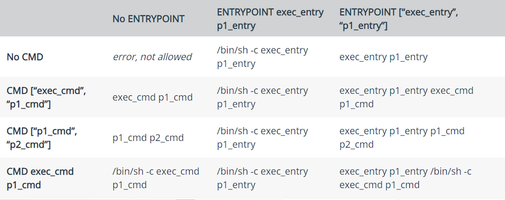

# dockerfile的学习

## 什么是Dockerfile？

 	Dockerfile构建镜像的方式就目前而言是使用最为广泛的，这是一种可以自动化生成镜像的一种方式，就类似shell脚本一样，一个脚本执行完就可以将一个服务安装配置好，支持正常使用了。Dockerfile也是一样，也是由一组指令组成的文件，其中每条指令对应Linux中的一条命令，Docker程序将通过读取Dockerfile中的指令最终生成镜像。

​	总结：Dockerfile=基础镜像信息+维护者信息+镜像操作指令+容器启动时执行指令

### 构建镜像

在脚本目录下使用语句即可：该命令会执行Dockerfile脚本命令创建镜像，镜像名为nginx版本号v3

* -t：表示后台运行

```dockerfile
docker build -t nginx:v3 .
```

## 指令详解：

### FROM

**FROM**：定制的镜像都是基于 FROM 的镜像，这里的 nginx 就是定制需要的基础镜像。后续的操作都是基于 nginx。

```dockerfile
FROM nginx
RUN echo '这是一个本地构建的nginx镜像' > /usr/share/nginx/html/index.html
```

### RUN

**RUN**：用于执行后面跟着的命令行命令。Run命令可以使用两种格式的语言执行，shell和exec。

shell 格式：

```dockerfile
RUN <命令行命令>
# <命令行命令> 等同于，在终端操作的 shell 命令。
```

exec 格式：

```dockerfile
RUN ["可执行文件", "参数1", "参数2"]
# 例如：
# RUN ["./test.php", "dev", "offline"] 等价于 RUN ./test.php dev offline
```

#### 特别注意

​	**注意**：Dockerfile 的指令每执行一次都会在 docker 上新建一层。所以过多无意义的层，会造成镜像膨胀过大。

```dockerfile
FROM centos
RUN yum install wget
RUN wget -O redis.tar.gz "http://download.redis.io/releases/redis-5.0.3.tar.gz"
RUN tar -xvf redis.tar.gz
以上执行会创建 3 层镜像。可简化为以下格式：
FROM centos
RUN yum install wget \
    && wget -O redis.tar.gz "http://download.redis.io/releases/redis-5.0.3.tar.gz" \
    && tar -xvf redis.tar.gz
```

如上，以 **&&** 符号连接命令，这样执行后，只会创建 1 层镜像。

### COPY

复制指令，从上下文目录中复制文件或者目录到容器里指定路径。

```dockerfile
COPY [--chown=<user>:<group>] <源路径1>...  <目标路径>
COPY [--chown=<user>:<group>] ["<源路径1>",...  "<目标路径>"]
```

**[--chown=<user>:<group>]**：可选参数，用户改变复制到容器内文件的拥有者和属组。

**<源路径>**：源文件或者源目录，这里可以是通配符表达式，其通配符规则要满足 Go 的 filepath.Match 规则。例如：

举例： 

```dockerfile
#COPY 当前目录下所有hom为前缀的文件到《镜像》的mydir文件目录下
COPY hom* /mydir/
COPY hom?.txt /mydir/
COPY src/ /app
```

**<目标路径>**：容器内的指定路径，该路径不用事先建好，路径不存在的话，会自动创建。

### ADD

ADD 指令和 COPY 的使用格类似（同样需求下，官方推荐使用 COPY）。功能也类似，不同之处如下：

- ADD 的优点：在执行 <源文件> 为 tar 压缩文件的话，压缩格式为 gzip, bzip2 以及 xz 的情况下，会自动复制并解压到 <目标路径>。
- ADD 的缺点：在不解压的前提下，无法复制 tar 压缩文件。会令镜像构建缓存失效，从而可能会令镜像构建变得比较缓慢。具体是否使用，可以根据是否需要自动解压来决定。

### CMD

类似于 RUN 指令，用于运行程序，但二者运行的时间点不同:

- CMD 在docker run 时运行。
- RUN 是在 docker build。

**作用**：为启动的容器指定默认要运行的程序，程序运行结束，容器也就结束。CMD 指令指定的程序可被 docker run 命令行参数中指定要运行的程序所覆盖。

**注意**：如果 Dockerfile 中如果存在多个 CMD 指令，仅最后一个生效。

```dockerfile
CMD <shell 命令> 
CMD ["<可执行文件或命令>","<param1>","<param2>",...] 
CMD ["<param1>","<param2>",...]  # 该写法是为 ENTRYPOINT 指令指定的程序提供默认参数
```

推荐使用第二种格式，执行过程比较明确。第一种格式实际上在运行的过程中也会自动转换成第二种格式运行，并且默认可执行文件是 sh。

#### CMD和ENTRYPOINT同时出现

* ENTRYPOINT非JSON格式（JSON格式就是带"[ ]"），以ENTRYPOINT为准
* ENTRYPOINT是JSON格式（JSON格式就是带"[ ]"），以CMD为准
* 如果ENTRYPOINT和CMD都是JSON格式，则将ENTRYPOINT+CMD的语句拼接使用

总结：两者不同取没有带【】的，两者相同，EN和CMD进行拼接。

要么记住1、3，要么记住2、3，都记住容易混淆



### ENTRYPOINT

类似于 CMD 指令，但其不会被 docker run 的命令行参数指定的指令所覆盖，而且这些命令行参数会被当作参数送给 ENTRYPOINT 指令指定的程序。

但是, 如果运行 docker run 时使用了 --entrypoint 选项，将覆盖 CMD 指令指定的程序。

**优点**：在执行 docker run 的时候可以指定 ENTRYPOINT 运行所需的参数。

**注意**：如果 Dockerfile 中如果存在多个 ENTRYPOINT 指令，仅最后一个生效。

格式：

```dockerfile
ENTRYPOINT ["<executeable>","<param1>","<param2>",...]
ENTRYPOINT shell语句...
```

可以搭配 CMD 命令使用：一般是变参才会使用 CMD ，这里的 CMD 等于是在给 ENTRYPOINT 传参，以下示例会提到。

示例：

假设已通过 Dockerfile 构建了 nginx:test 镜像：

```dockerfile
FROM nginx

ENTRYPOINT ["nginx", "-c"] # 定参
CMD ["/etc/nginx/nginx.conf"] # 变参 
```

* 不传参运行

```dockerfile
$ docker run  nginx:test
```

容器内会默认运行以下命令，启动主进程。

```dockerfile
nginx -c /etc/nginx/nginx.conf
```

传参运行

```dockerfile
$ docker run  nginx:test -c /etc/nginx/new.conf
```

容器内会默认运行以下命令，启动主进程(/etc/nginx/new.conf:假设容器内已有此文件)

```dockerfile
nginx -c /etc/nginx/new.conf
```

#### CMD和ENTRYPOINT同时出现

* ENTRYPOINT非JSON格式（JSON格式就是带"[ ]"），以ENTRYPOINT为准
* ENTRYPOINT是JSON格式（JSON格式就是带"[ ]"），以CMD为准
* 如果ENTRYPOINT和CMD都是JSON格式，则将ENTRYPOINT+CMD的语句拼接使用

总结：两者不同取没有带【】的，两者相同，EN和CMD进行拼接。

要么记住1、3，要么记住2、3，都记住容易混淆


### ENV

设置环境变量，定义了环境变量，那么在后续的指令中，就可以使用这个环境变量。

格式：

```dockerfile
ENV <key> <value>
ENV <key1>=<value1> <key2>=<value2>...
```

以下示例设置 NODE_VERSION = 7.2.0 ， 在后续的指令中可以通过 $NODE_VERSION 引用：

```dockerfile
ENV NODE_VERSION 7.2.0

RUN curl -SLO "https://nodejs.org/dist/v$NODE_VERSION/node-v$NODE_VERSION-linux-x64.tar.xz" \
  && curl -SLO "https://nodejs.org/dist/v$NODE_VERSION/SHASUMS256.txt.asc"
```

### ARG

构建参数，与 ENV 作用一致。不过作用域不一样。ARG 设置的环境变量仅对 Dockerfile 内有效，也就是说只有 docker build 的过程中有效，构建好的镜像内不存在此环境变量。

构建命令 docker build 中可以用 --build-arg <参数名>=<值> 来覆盖。

格式：

```dockerfile
ARG <参数名>[=<默认值>]
```

### VOLUME

定义匿名数据卷。在启动容器时忘记挂载数据卷，会自动挂载到匿名卷。

作用：

- 避免重要的数据，因容器重启而丢失，这是非常致命的。
- 避免容器不断变大。

格式：

```
VOLUME ["<路径1>", "<路径2>"...]
VOLUME <路径>
```

在启动容器 docker run 的时候，我们可以通过 -v 参数修改挂载点。

### EXPOSE

仅仅只是声明端口。

作用：

- 帮助镜像使用者理解这个镜像服务的守护端口，以方便配置映射。
- 在运行时使用随机端口映射时，也就是 docker run -P 时，会自动随机映射 EXPOSE 的端口。

格式：

```
EXPOSE <端口1> [<端口2>...]
```

### WORKDIR

指定工作目录。用 WORKDIR 指定的工作目录，会在构建镜像的每一层中都存在。（WORKDIR 指定的工作目录，必须是提前创建好的）。

docker build 构建镜像过程中的，每一个 RUN 命令都是新建的一层。只有通过 WORKDIR 创建的目录才会一直存在。

格式：

```
WORKDIR <工作目录路径>
```

### USER

用于指定执行后续命令的用户和用户组，这边只是切换后续命令执行的用户（用户和用户组必须提前已经存在）。

格式：

```
USER <用户名>[:<用户组>]
```

### HEALTHCHECK

用于指定某个程序或者指令来监控 docker 容器服务的运行状态。

格式：

```
HEALTHCHECK [选项] CMD <命令>：设置检查容器健康状况的命令
HEALTHCHECK NONE：如果基础镜像有健康检查指令，使用这行可以屏蔽掉其健康检查指令

HEALTHCHECK [选项] CMD <命令> : 这边 CMD 后面跟随的命令使用，可以参考 CMD 的用法。
```

### ONBUILD

用于延迟构建命令的执行。简单的说，就是 Dockerfile 里用 ONBUILD 指定的命令，在本次构建镜像的过程中不会执行（假设镜像为 test-build）。当有新的 Dockerfile 使用了之前构建的镜像 FROM test-build ，这时执行新镜像的 Dockerfile 构建时候，会执行 test-build 的 Dockerfile 里的 ONBUILD 指定的命令。

格式：

```
ONBUILD <其它指令>
```

### LABEL

LABEL 指令用来给镜像添加一些元数据（metadata），以键值对的形式，语法格式如下：

```
LABEL <key>=<value> <key>=<value> <key>=<value> ...
```

比如我们可以添加镜像的作者：

```
LABEL org.opencontainers.image.authors="runoob"
```

## Dockfile镜像构建

构建镜像的三种方式:

- Dockerfile
- 基于已有的镜像容器进行创建
- 基于本地模板创建

### 镜像案例

#### 基于Centos7的java镜像

* 需要先docker pull centos:7.5.1804
* 需要先下载jdk-8u131-linux-x64.tar.gz到当前目录下

```dockerfile
FROM centos:7.5.1804

#2.指明该镜像的作者和其电子邮件
MAINTAINER zsp

#3.在构建镜像时，指定镜像的工作目录，之后的命令都是基于此工作目录，如果不存在，则会创建目录
WORKDIR /zsp_docker/jdk

#4.一个复制命令，把jdk安装文件复制到镜像中，语法：ADD <src>... <dest>,注意：jdk*.tar.gz使用的是相对路径
ADD jdk-8u131-linux-x64.tar.gz /zsp/jdk/

#5.配置环境变量
ENV JAVA_HOME=/zsp_docker/jdk/jdk1.8.0_221
ENV CLASSPATH=.:$JAVA_HOME/lib/dt.jar:$JAVA_HOME/lib/tools.jar
ENV PATH=$JAVA_HOME/bin:$PATH

#容器启动时需要执行的命令
#CMD ["java","-version"]
```

#### 基于alpine的java镜像

* localhost:8000：本地的服务，因为服务器在本地起的，所以只能模拟一个地址下载

```dockerfile
FROM alpine:3.14

ENV LANG=C.UTF-8

# Here we install GNU libc (aka glibc) and set C.UTF-8 locale as default.

RUN ALPINE_GLIBC_BASE_URL="http://localhost:8000/" && \
    ALPINE_GLIBC_PACKAGE_VERSION="2.33-r0" && \
    ALPINE_GLIBC_BASE_PACKAGE_FILENAME="glibc-$ALPINE_GLIBC_PACKAGE_VERSION.apk" && \
    ALPINE_GLIBC_BIN_PACKAGE_FILENAME="glibc-bin-$ALPINE_GLIBC_PACKAGE_VERSION.apk" && \
    ALPINE_GLIBC_I18N_PACKAGE_FILENAME="glibc-i18n-$ALPINE_GLIBC_PACKAGE_VERSION.apk" && \
    apk add --no-cache --virtual=.build-dependencies wget ca-certificates && \
    echo \  
        "-----BEGIN PUBLIC KEY-----\
        MIIBIjANBgkqhkiG9w0BAQEFAAOCAQ8AMIIBCgKCAQEApZ2u1KJKUu/fW4A25y9m\
        y70AGEa/J3Wi5ibNVGNn1gT1r0VfgeWd0pUybS4UmcHdiNzxJPgoWQhV2SSW1JYu\
        tOqKZF5QSN6X937PTUpNBjUvLtTQ1ve1fp39uf/lEXPpFpOPL88LKnDBgbh7wkCp\
        m2KzLVGChf83MS0ShL6G9EQIAUxLm99VpgRjwqTQ/KfzGtpke1wqws4au0Ab4qPY\
        KXvMLSPLUp7cfulWvhmZSegr5AdhNw5KNizPqCJT8ZrGvgHypXyiFvvAH5YRtSsc\
        Zvo9GI2e2MaZyo9/lvb+LbLEJZKEQckqRj4P26gmASrZEPStwc+yqy1ShHLA0j6m\
        1QIDAQAB\
        -----END PUBLIC KEY-----" | sed 's/   */\n/g' > "/etc/apk/keys/sgerrand.rsa.pub" && \
    wget \
        "$ALPINE_GLIBC_BASE_URL/$ALPINE_GLIBC_BASE_PACKAGE_FILENAME" \
        "$ALPINE_GLIBC_BASE_URL/$ALPINE_GLIBC_BIN_PACKAGE_FILENAME" \
        "$ALPINE_GLIBC_BASE_URL/$ALPINE_GLIBC_I18N_PACKAGE_FILENAME" && \
    apk add --no-cache \
        "$ALPINE_GLIBC_BASE_PACKAGE_FILENAME" \
        "$ALPINE_GLIBC_BIN_PACKAGE_FILENAME" \
        "$ALPINE_GLIBC_I18N_PACKAGE_FILENAME" && \
    \
    rm "/etc/apk/keys/sgerrand.rsa.pub" && \
    /usr/glibc-compat/bin/localedef --force --inputfile POSIX --charmap UTF-8 "$LANG" || true && \
    echo "export LANG=$LANG" > /etc/profile.d/locale.sh

```


