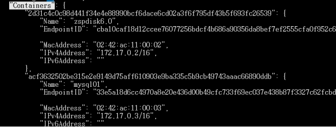
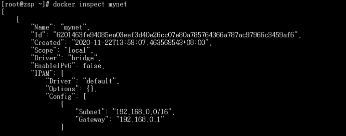
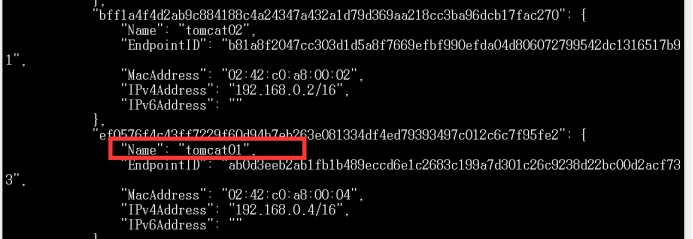

# docker网络知识

### 查看网络情况：

```shell
ip addr
```


255.255.0.1/16域局域网!表示前16位是固定的，所以可用网段为后16位即255*255个

* 解释：256是2的8次方，所以前16位是255.255，后面的0.1则是可以随意变动的

### Docker是如何处理容器网络的？


运行以下命令，查看单个容器的网络情况：

```shell
docker exec -it zspdisk6.0 ip addr
```

 查看容器内部的ip地址（查看容器ip地址172.17.0.2是容器内的ip地址：


发现linux是可以ping通docker容器内部的：

 

### 原理：

* 我们每启动一个docker容器，docker就会给docker容器分配一个ip，我们只要安装了docker，就会有一个网卡docker0
* 我们的linux和容器之间使用的是桥接模式，使用的技术是evth-pair技术！ 
* 通过查看容器内ip和在linux使用ip addr发现两者的ip addr一样：
  * 我们发现这个容器带来网卡,都是一对对的
  * evth-pair就是一对的虚拟设备接口，他们都是成对出现的，一段连着协议，一段彼此相连
  * 正因为有这个特性，evth-pair充当一个桥粱，连接各种虚拟网络设备的
  * openStac，Docker容器之间的连接，oVS的连接，都是使用evth-pair技术


我们来测试下 tomcat01和tomcat 02是否可以ping通!

```shell
docker exec -it tomcat02 ping 172.18.0.2
```

发现是可以ping通的，说明同一ip下的容器是可以互相ping通的，但不同ip下的容器是ping不通的：


绘制网络模型图：图解两容器互相ping对方：

 

结论:tomcat01和tomcat02是公用的一个路由器，docker0。

所有的容器不指定网络的情况下，都是docker0路由的，docker会给我们的容器分配一个默认的可用IP。

255.255.0.1/16域局域网!表示前16位是固定的，所以可用网段为后16位即255*255个

* 解释：256是2的8次方，所以前16位是255.255，后面的0.1则是可以随意变动的

（可用网段从255.255.0.0到255.255.255.255


**Docker内通信示意图：docker使用的linux的桥接，宿主机中是一个docker容器的桥接**

 

Docker中的所有网络接口都是虚拟的，虚拟的转发效率高。（内网传递）

 

### LINK（不推荐使用了，只是在host文件中做了映射）

高可用!

思考一个场景，我们编写了一个微服务，database url=ip:，项目不重启，数据库ip换掉了，我们希望可以处理这个问题，

可以用名字来进行访问容器。

 

1、我们直接使用tomcat1去ping tomcat2发现会报错，service not konwn

 

2、接下来我们使用 docker run  --link 去连接我们要ping通的容器即可

(1) 例如：docker run -d -p --name tomcat03 --link tomcat02 tomcat

发现3是可以ping通2的

 

(2) 但是如果使用docker2去ping docker3却不行

3、使用docker network去查看linux内网络桥接问题：

(1) 使用ls去查找容器内的网络桥接信息，发现和原本一样

 

(2) 查看详情（使用docker inspect容器id

```
docker inspect aa87
```

 

(3) 然后你会发现containers里面存储着容器和linux的桥接关系

 

(4) 也可以发现docker0的配置

 

4、使用docker inspect docker3,并没有发现关于docker2的网关配置

进入docker3容器后，使用docker exec -it tomcat3  cat  /etc/hosts发现：

我们使用link来连通的tomcat3和tomcat2不过是在host文件里面做了一个映射罢了。


--link就是我们在hosts配置中增加了一个172.18.03tomcat02 312857784cd4

也就是我们使用tomcat3 ping tomcat2的时候就等于直接ping了tomcat2一样，这样缺陷很大，因为当容器重新启动的话，我们的host没有更改，还是一样ping不通。

 

我们现在玩Docker已经不建议使用--link 了 !他不支持我们的容器名访问，即不支持微服务访问。

 

### 查看和选择网络

查看所有的docker网络

```shell
Docker network ls
```

 

网络模式：

* bridge:桥接docker(默认，自己创建也使用bridge模式)

* none:不配置网络

* host :和宿主机共享网络

* container :容器网络连通!(用的少!局限很大)

测试：

* 首先使用docker network --help 查询一下有什么语句

 

* 我们直接启动的命令--net bridge，而这个就是我们的Dockero

```shell
docker run -d -P --name tomcat01 --net bridge tomcat
```

* docker0特点;默认，域名不能访间， --link可以打通连接!

### 自定义网络

* 创建属于自己的网段

```shell
docker  network create --driver bridge --subnet 192.168.0.0/16 --gateway 192.168.0.1 mynet
```

* --driver 网络模式（默认就是bridge）

* --subnet 配置子网

* --gateway 网关

* mynet 网关名字

 

* 查看自己写的网络：

 

* 使用自己创造的网络

```
docker run -d -P --name nginx02 --net mynet nginx
```


使用docker network inspect mynet 再次查看我们的mynet

```
docker network inspect mynet 
```

* 发现上面挂载了两个容器

 

使用自己创建的网络好处是什么：

* 可以由容器直接访问容器了。比link方便多了，且不会修改配置文件

* 自定义的网络都帮我们维护好了容器内关系


 

好处:

redis 不同的集群使用不同的网络，保证集群是安全和健康的

mysql不同的集群使用不同的网络，保证集群是安全和健康的


### 网络连通

我们想要两个不同的网络区域互相连通，怎么做？

* 首先想到的是使用不同网络区域的两个容器直接ping，发现做不到

 

* 然后根据官方的help文档我们发现。
  * 存在一个connet方法，可以连通容器和网络。示意图如下：

 

 

 

 

 

* 再次查看帮助发现，需要使用的的话，指令是

```shell
docker network connect mynet tomcat01
```

 

做完连接后发现成功ping通：接下去去查看怎么实现的

```shell
docker network connect mynet tomcat01
```

 

使用inspect 会发现，其实connect就是把我们的tomcat01添加进我们的mynet里

```shell
docker network inspect mynet
```

 

就是一个容器两个ip地址.

例如：阿里云服务:公网ip私网ip

结论︰假设要跨网络操作别人，就需要使用docker network connect 连通!

 

 

 

 

 

 

